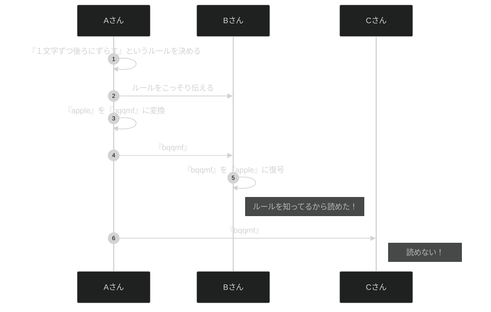
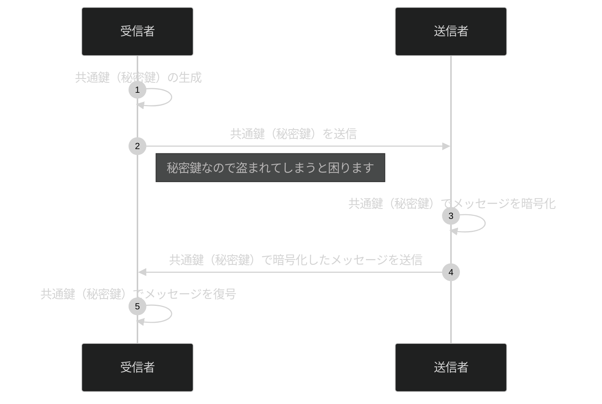
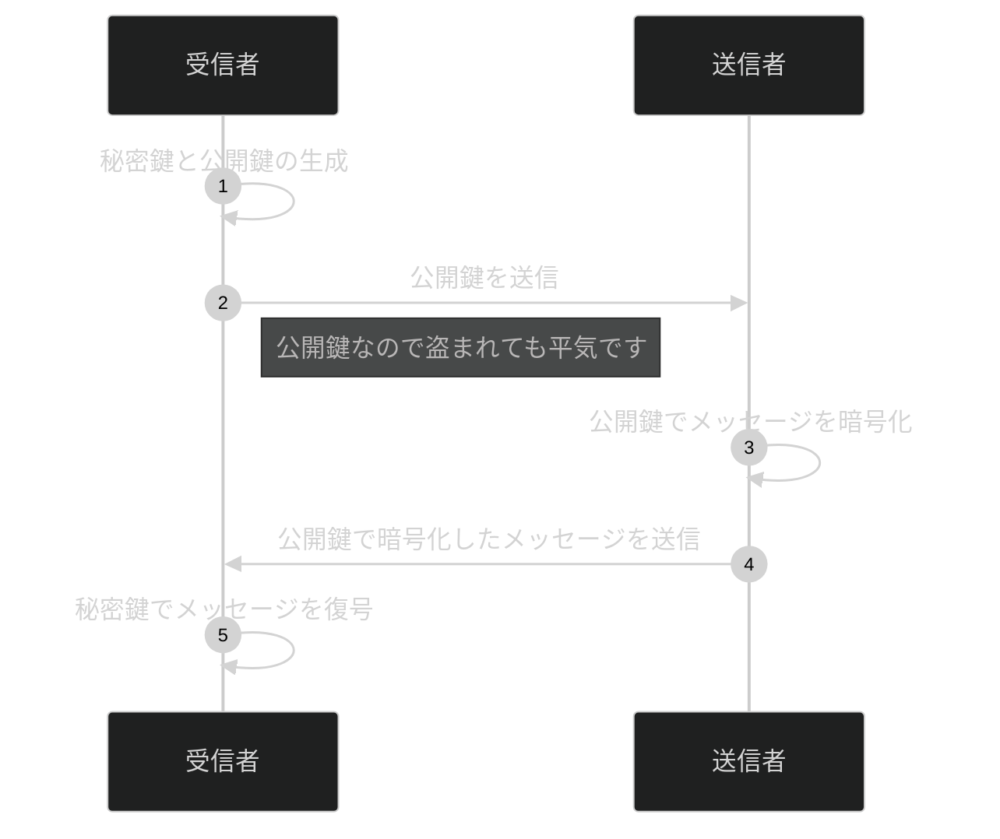
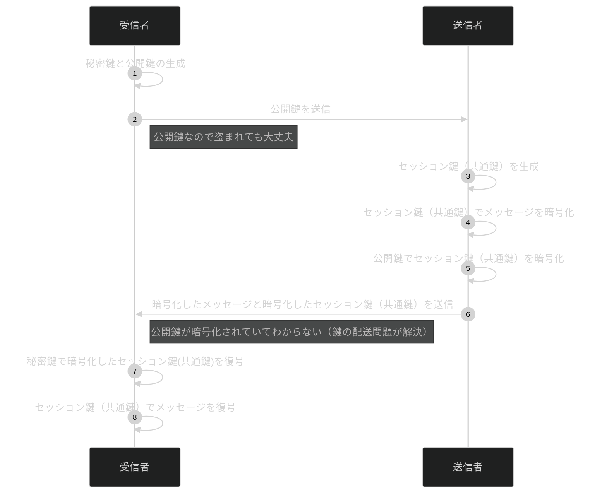

## はじめに

### 記事の目的
本記事の目的は、私が情報処理安全確保支援士を目指す過程で学んだことのアウトプットです。
来年春季試験での合格を目指しています。
皆様の勉強にも少しでも役立てば幸いです。

### 記事の対象者
- セキュリティ初心者
- 情報処理安全確保支援士を目指す方

## 暗号と復号
私たちが普段書いている誰でも読める文を平文と言います。それをあるルールに従って読めないようにしたものが暗号文です。（ルールがないと誰も元の文章に戻せなくなってしまいます）
平文を暗号文に変えることを暗号化と言います。逆に、暗号文を平文に戻すことを復号と言います。

例えば、『apple』という平文を1文字ずつ後ろにずらすというルールで暗号化すると『bqqmf』となります。ここで、平文を読んで欲しい人だけに一文字ずつずらしたというルールを伝えることで『apple』に復号することが可能です。

## 暗号化方式の種類
暗号化方式はさまざまなものがありますが、代表的な分類として以下２つがあります。
- 共通鍵暗号方式
- 公開鍵暗号方式

また上記２つを組み合わせたハイブリット暗号（セッション鍵）方式もあります。

### 共通鍵暗号方式とは

1つの共通鍵（秘密鍵）を使用する暗号方式です。
暗号化と復号両方に共通鍵（秘密鍵）を使用します。

共通鍵は『秘密』鍵ですので、第3者に盗まれてはいけません。
盗まれてしまうと復号されてしまう恐れがあります。
共通鍵（秘密鍵）を盗まれずにどうやって渡すか？という問題を鍵の配送問題と言います。

ここで一緒に覚えておきたいのが必要な鍵の個数です。
通信をする人が全部でn人いると想定すると、各ペアで１つの秘密鍵を使用するので、組合わせを考えれば良いです。
つまり、nC2＝n(n-1)/2個必要になります。

### 公開鍵暗号方式とは

秘密鍵と公開鍵の２つを使用する暗号方式です。
暗号化に公開鍵、復号に秘密鍵を使用します。

公開鍵は広く一般に公開されているので盗まれても問題ありません。ただし、入手した公開鍵が本物か？という問題は残ります。これを、公開鍵の認証問題と言います。

必要な鍵の個数は、通信をする人が全部でn人いると想定すると各人が自分用の秘密鍵と皆に渡す公開鍵の２つが必要なので2n個必要になります。

## 共通鍵暗号方式と公開鍵暗号方式の比較

|      | 共通鍵暗号方式 | 公開鍵暗号方式 | 
| ---- | ---- | ---- |
| 鍵の数 | 共通鍵（秘密鍵）1つ | 秘密鍵と公開鍵の2つ |
| 処理時間 | 速い | 遅い |
| 鍵の管理 | 通信相手ごとに共通鍵が必要なので大変 | １つの秘密鍵を管理すればいいので楽 |
| 問題 | 盗まれずに鍵を渡すには？ （鍵の配送問題） | 盗まれてもいいが本物かどうかの確認は？ （鍵の認証問題） |

## ハイブリッド暗号（セッション鍵）方式とは

共通鍵暗号方式と公開鍵暗号方式のそれぞれにメリットデメリットがあるので組み合わせて使おうというのがハイブリッド暗号（セッション鍵）方式です。
処理が速い共通鍵暗号方式を使い、鍵の配送問題を公開鍵暗号方式によって解決します。

## 実際にMacで確認

### 公開鍵の確認
ここで実際に公開鍵を確認してみます

:::message
共通鍵（秘密鍵）はセキュリティの都合上簡単には見られないようです。
:::

#### 1.画面上部にあるURLの左の鍵アイコンをクリック

#### 2.詳細を表示をクリック

#### 3.公開鍵を確認

## まとめ
- 共通鍵暗号方式は1つの共通鍵を使用します。処理は速いが、管理する鍵の数が多くて大変です。また、鍵の配送問題があります。
- 公開鍵暗号方式は秘密鍵と公開鍵の2つを使用します。処理は遅いが、管理する鍵の数が少なくて楽です。鍵の配送問題が解決できますが、鍵の認証問題が残ります。
- 共通鍵暗号方式の処理が速いメリットを残しつつ、公開鍵暗号方式で鍵の配送問題を解決したのがハイブリット暗号方式です。
  
## 注意事項

この記事の内容は、筆者の理解をもとに執筆していますが、一部に誤りが含まれている可能性があります。もし不正確な箇所や改善点を見つけた場合は、ぜひコメントやフィードバックでお知らせいただけると幸いです。

より正確な情報を提供できるよう、随時修正・更新を行っていきます。  
ご理解とご協力をよろしくお願いします。

## 参考

[まさるの勉強部屋](https://www.youtube.com/@masaru-study)
[シーケンス図で「暗号技術」と「認証」を理解する【情報処理安全確保支援士 試験対策】](https://qiita.com/mkt_hanada/items/76b5aab4996700866915)
