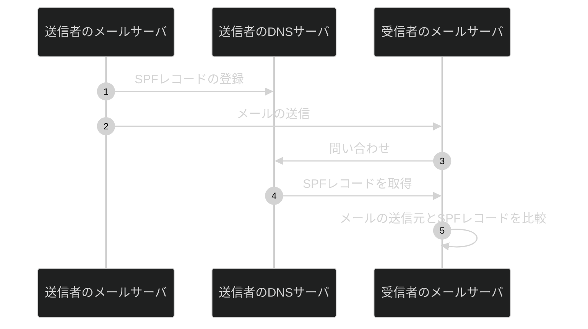
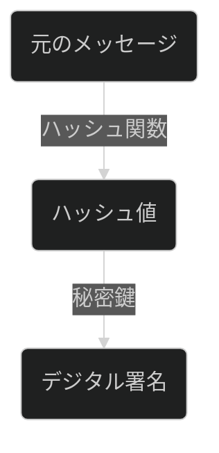
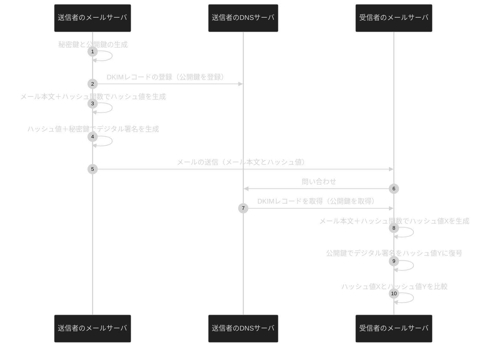
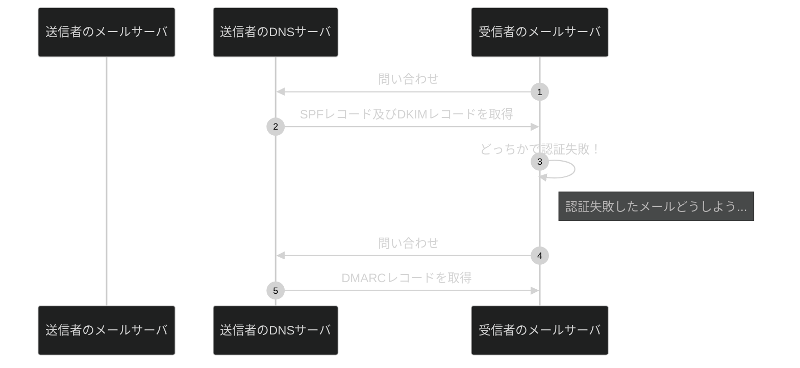

## はじめに

### 記事の目的
本記事の目的は、私が情報処理安全確保支援士を目指す過程で学んだことのアウトプットです。
来年春季試験での合格を目指しています。
皆様の勉強に少しでも役立てば幸いです。

### 記事の対象者
- セキュリティ初心者
- 情報処理安全確保支援士を目指す方

## メール認証方式の種類
メール認証方式はさまざまなものがありますが、代表的なものとして以下２つがあります。
- SPF
- DKIM

また上記とよく一緒に説明されるDMARCについても説明します。

### SPFとは

SPFはSender Policy Frameworkの略で、日本語で言うと送信者を認証するための仕組みといったところでしょうか。
メール送信者があらかじめ『私は必ずこの場所からメールを出しますよ』と宣言しておき、メール受信者がどこからメールが来たのか確認することで、メールの送信者がなりすましされてないことを確認します。

実際にはまず、メール送信者が自身のドメインのDNSサーバーにSPFレコードとしてIPアドレス等を登録します。

:::message
DNSサーバは名前解決を主に行いますが、SPFレコードは頻繁に参照されるため皆んながアクセスしやすいDNSサーバに書いてしまおうと言う考えです
:::

SPFレコードの例
```js
sample.com. 300 IN TXT "v=spf1 +ip4:10.20.30.40 -all"
```

| 項目 | 説明 |
| ---- | ---- |
| sample.com | sample.comのDNSサーバに問い合わせた結果なので |
| 300 | TTL（time to live）を表し、300秒ごとにレコードまた見てくださいということ |
| IN | INTERNETの略 |
| TXT | テキストベースで残したい情報が続きます（続きが””でコメントになっています） |
| v=spf1 | SPFレコードであることを示す |
| +ip4:10.20.30.40 | 送信者のIPアドレス |
| -all | ↑のIPアドレス以外からのメールは全て拒否してくださいということ |

最後の『-all』に関してはいくつか種類があるので一緒に覚えておきましょう

| 種類 | SPFレコードに載ってないIPアドレスからのメールは... |
| ---- | ---- |
| -all | 受け取らないでください |
| ~all | 迷惑メールとして受け取ってください |
| +all | 必ず受け取ってください |
| ?all | おまかせします |


SPFレコード登録後にメールを送信し、メール受信者が、送信者のドメインのDNSサーバーに問い合わせを行いSPFレコードを確認します。上の例で言うとIPアドレスが10.20.30.40なので、メールの送信元と同じであれば問題無し。異なっていれば、なりすましされていることがわかります。



### DKIMとは

DKIMはDomainkeys Identified Mailの略で、日本語で言うとドメイン鍵で認証するメールという感じです。
メール送信者があらかじめ、送信したメールを開けられる鍵を置いておき、メール受信者はその鍵で開けられるかを確認することで、メールの送信者がなりすまし及び改ざんされてないことを確認します。

:::message
SPFではなりすましされていないことのみ確認できました。改ざんについては送信元のIPアドレスによる確認なので、中身が変わっていてもわからないからです。DKIMではなりすましされていないことに加えて改ざんされていないことも確認できます。その理由はこの後説明します。
:::

実際にはまず、メール送信者が秘密鍵と公開鍵を生成し、自身のドメインのDNSサーバーにDKIMレコードとして公開鍵等を登録します。

DKIMレコードの例
```js
selector._domainkey.sample.com IN TXT "v=DKIM1; k=rsa; p=AMESHI..(略)..ZEN"
```
| 項目 | 説明 |
| ---- | ---- |
| selector._domainkey.sample.com | セレクターです。どの鍵を使えばいいのかを特定するための情報 |
| IN | INTERNETの略 |
| TXT | テキストベースで残したい情報が続きます（続きが””でコメントになってますね） |
| v=DKIM1 | DKIMレコードであることを示す |
| k=rsa | 署名アルゴリズム。RSA暗号で署名されています |
| p=AMESHI..(略)..ZEN | 公開鍵 |

DKIMレコード登録後に秘密鍵でデジタル署名をしたメールを送信します。送信したメールのDKIM_Signatureヘッダーにセレクタを登録しておきます。メール受信者は、セレクタを使って送信者のドメインのDNSサーバーに問い合わせを行い、DKIMレコードを確認します。そこで取得した公開鍵でデジタル署名を検証し、ハッシュ値が同じなら問題無し。異なれば、改ざんされていることがわかります。なぜなら、デジタル署名は元メッセージをベースに作成されているからです。


実際に届いたメールのデジタル署名を公開鍵で復号してハッシュ値XXXを取得します。
実際に届いたメールの本文に同じハッシュ関数を使ってハッシュ値YYYを取得します。
XXX=YYYであればなりすましされていないことと、改ざんされていないことが確認できます。

:::message
メッセージが改竄されていればハッシュ値は一致しません。また、なりすましであれば偽物の秘密鍵でデジタル署名されているので公開鍵で復号してもハッシュ値が一致しません。
:::

また、そもそもセレクタで公開鍵が見つからない場合はなりすましの可能性があります。


## SPFとDKIMの比較

|      | SPF | DKIM | 
| ----| ---- | ---- |
| 確認方法 | IPアドレスの比較 | デジタル署名の検証 |
| 証明できること | なりすましではないこと | なりすましではないこと、改ざんされていないこと |


## DMARCとは

DMARCとはDomain-based Message Authentication, Repoting, and Conformanceの略です。SPFまたはDKIMで不正なメールと判断された場合にそのメールの扱いをどうするかを決めるものです。

送信者があらかじめDMARCレコードをDNSサーバに登録します。

DMARCレコードの例
```js
v=DMARC1; p=quarantine; rua=mailto:report@ameshi.co.jp
```
| 項目 | 説明 |
| ---- | ---- |
| v=DMARC1 | DMARCレコードであることを示します |
| p=quarantine | 認証失敗時のメールの扱い |
| rua=mailto:report@ ameshi.co.jp | 認証レポートの送信先 |

ここで『p』の種類も覚えておきましょう
| 種類 | 認証に失敗したメールは... |
| ---- | ---- |
| none | 特に指示はありません（とりあえず受け取ってください） |
| quarantine | 迷惑メールとして受け取ってください |
| reject | 受け取らないでください |



## 実際にMacで確認

### SPFレコードの確認
実際にSPFレコードを確認してみます

#### 1.ターミナルを起動


#### 2.nslookupコマンドを実行


#### 3.SPFレコードの発見
多少形式は違いますが、だいたい一緒です。
ここで出てくる『include』はそこのドメインのSPFレコードのル-ルに従うと言う意味です。


『nslookup -type=txt spf.protection.outlook.com』も見てみましょう。
ここに載っているIPアドレスからのメールは受信してよさそうです。最後が『-all』なのでそれ以外は拒否してほしいみたいです。


### DKIM_Signatureヘッダの確認
実際にメールのDKIM_Signatureヘッダを確認してみます

#### 1.Gmailで適当なメールを開く
右上の『・・・』をクリック


#### 2.メッセージのソースを表示をクリック


#### 3.DKIM_Signature発見


| 項目 | 説明 |
| ---- | ---- |
| v=1 | DKIMのバージョンで基本的に1|
| a=rsa-sha256 | rsa暗号でSHA256でハッシュ化したということ |
| c=relaxed/relaxed | 正規化方法。relaxedは本文の無駄な空白を除去。 |
| d=accounts.google.com | 署名を付与したドメイン |
| s=20230601 | セレクタ。これを使ってDNSサーバで公開鍵を探します |
| t=1729134274 | 署名された日時（タイムスタンプ） |
| x=1729739074 | 署名の有効日時 |
| h=...(略) | 署名対象のヘッダー |
| bh=...(略) | メール本文のハッシュ値 |
| b=...(略) | デジタル署名 |

:::message
dara=google.comは何を表すのかわかりませんでした
:::

### DKIMレコードの確認
実際にメールのDKIMレコードを確認してみます

#### 1.ターミナルを起動


#### 2.nslookupコマンドを実行
DKIM_Signature実際に確認した結果以下の２つがわかりました。
これを使ってDNSサーバに問い合わせてみます。
| 項目 | 説明 |
| ---- | ---- |
| d=accounts.google.com | 署名を付与したドメイン |
| s=20230601 | セレクタ。これを使ってDNSサーバで公開鍵を探します |


#### 3.DKIMレコードの発見

公開鍵をしっかり確認することができました


### DMARCレコードの確認
実際にDMARCレコードを確認してみます

#### 1.ターミナルを起動


#### 2.nslookupコマンドを実行


#### 3.DMARCレコードの発見


| 項目 | 説明 |
| ---- | ---- |
| sp=reject | サブドメインからのメールの認証に失敗した場合の扱い |
| adkim=s | DKIMにおける署名したドメインと送信元ドメインが完全に一致すること |
| aspf=s | SPFの送信元IPアドレスが完全に一致すること |

サブドメインというのは例えばsample.comというメインのドメインがあった場合にsub.sample.comみたいなドメインです。
adkimとaspfは条件をさらに厳しくしてサブドメインとかは許しません、という設定のようです。のパラメータは『s』（strict）以外だと『r』(relax)があるみたいですね。こちらはサブドメインでも許可する設定のようです。
例えば、sample.comから送信したメールにsub.sample.comが署名したメールでも許可されるということです。

## まとめ
- SPFはIPアドレスの比較でなりすましではないことを確認する
- DKIMはデジタル署名を検証することでなりすましではないこと、改ざんされていないことを確認する
- DMARKはSPF及びDKIMで不正なメールだと判断された時のメールの扱いを決める
  
## 注意事項

この記事の内容は、筆者の理解をもとに執筆していますが、一部に誤りが含まれている可能性があります。もし不正確な箇所や改善点を見つけた場合は、ぜひコメントやフィードバックでお知らせいただけると幸いです。

より正確な情報を提供できるよう、随時修正・更新を行っていきます。  
ご理解とご協力をよろしくお願いします。

## 参考

[まさるの勉強部屋](https://www.youtube.com/@masaru-study)
