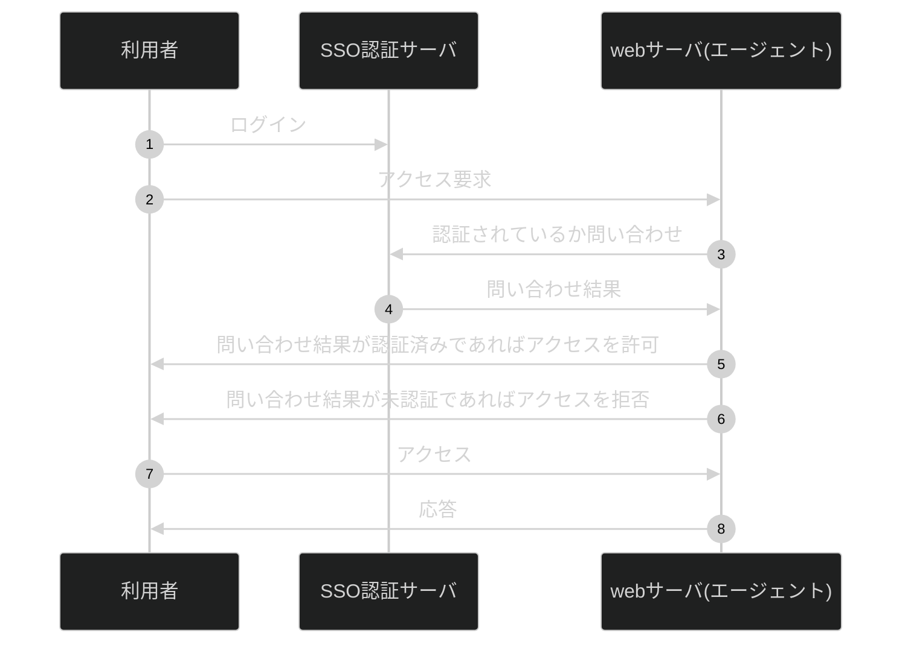
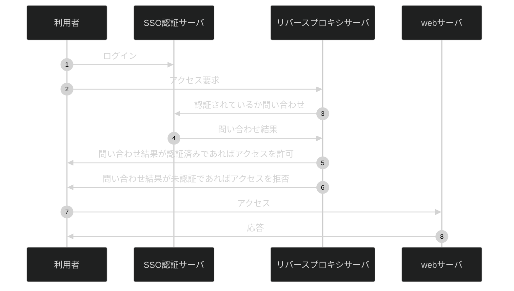
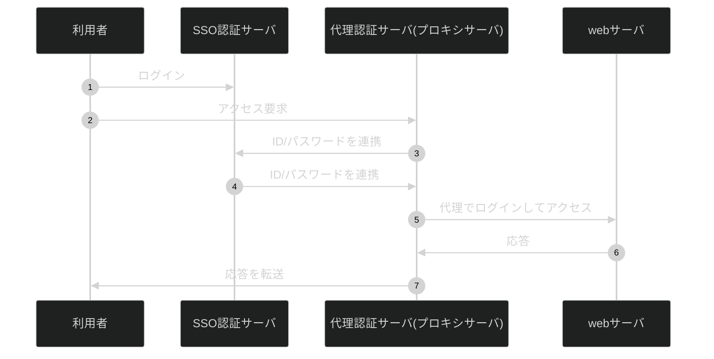

## はじめに

### 記事の目的
本記事の目的は、私が情報処理安全確保支援士を目指す過程で学んだことのアウトプットです。
皆様の勉強にも少しでも役立てば幸いです。

### 記事の対象者
- セキュリティ初心者
- 情報処理安全確保支援士を目指す方

## IAMとは
IAM(Identity and Access Management)とは、『誰が』、『何に』、『どこまでアクセスできるか』を管理する仕組みをです。

## 基本的な概念

| 概念 | 説明 |
| ---- | ---- |
| 識別 | 誰がアクセスしているのかを判別すること |
| 認証 | アクセスしているの本人か確認すること |
| 認可 | 権限を与えること |
| アカウンティング | 誰が何をしたのかをログに残すこと |

RFC2904ではアクセスコントロールに必要な構成要素をAAAフレームワークとして規定されています。
AAAとは認証（Authetication）、認可（Authorization）、アカウンティング(Accounting)の頭文字Aをとったものです。

:::message
RFCとは、インターネットの決まり事をまとめた文書です。そこで定めた2904番目ルールです。
:::

## シングルサインオン(SSO)

何かのシステムを利用するためにパスワードとIDを用意する必要があります。しかし、利用するシステムが多くなってくるとパスワードのIDの管理が大変になってしまいます。それを解決するために考えられたのがシングルサインオンという仕組みです。

シングルサインオンを実現すると、１つのシステムにログインすると、複数のシステムが利用可能になり、毎回IDとパスワードを入力する必要がなくなります。

### 種類

| 種類 | 説明 |
| ---- | ---- |
| エージェント方式 | 利用するサーバにエージェントをインストールしておき、アクセスした際にエージェントが認証する |
| リバースプロキシ方式 | リバースプロキシサーバを設置し、リバースプロキシが認証し各サーバへのアクセスを許可する。 |
| 代理認証方式 | 権限を与えること |

:::message
他にもケルベロス認証方式とID連携方式があります
:::

#### エージェント方式

#### リバースプロキシ方式

:::message
リバースプロキシサーバは目的のサーバにアクセスしたときに必ず経由するサーバです。
リバースプロキシサーバが設置されていない場合は目的のサーバに直接アクセス可能です
:::

#### 代理認証方式

  
## 注意事項

この記事の内容は、筆者の理解をもとに執筆していますが、一部に誤りが含まれている可能性があります。もし不正確な箇所や改善点を見つけた場合は、ぜひコメントやフィードバックでお知らせいただけると幸いです。

より正確な情報を提供できるよう、随時修正・更新を行っていきます。  
ご理解とご協力をよろしくお願いします。

## 参考

三好康之『2025　情報処理安全確保支援士「専門知識+午後問題」の重点対策』アイテック、2024年。
